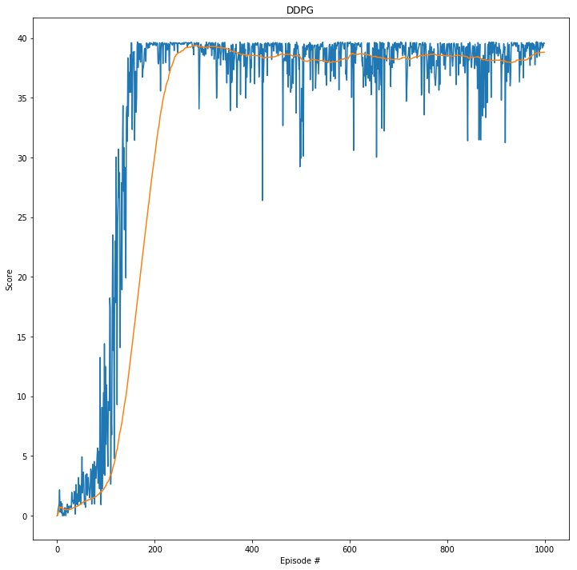
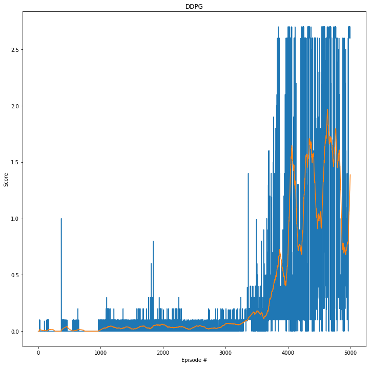

# Reports for the Deep Reinforcement Learning Nanodegree at Udacity

Here, you can find the reports regarding the three projects within the course. The projects are:
1. [Training an agent to collect yellow bananas while avoiding blue bananas.](#project-1-banana-collector-report)
2. [Training a robotic arm to reach target locations.](#project-2-reacher)
3. [Training a pair of agents to play tennis.](#project-3-tennis)

## Project 1: Banana Collector Report
### Implementation
The banana collector project consists of 
* main notebook [banana-collector](./project1-banana-collector/banana-collector.ipynb): it provides some information about the environment and runs the DQN algorithm against the headless Unity Environment of banana collector. It makes use of the python classes Agent ([agent.py](project1-banana-collector/modules/agent.py)), QNetwork ([qnetwork.py](project1-banana-collector/modules/qnetwork.py)) and ReplayBuffer ([replaybuffer.py](project1-banana-collector/modules/replaybuffer.py)).
* play notebook [banana-collector-play](./project1-banana-collector/banana-collector-play.ipynb): this notebook is reading a created q-network and is using the visual Unit Environment of banana collector. You will see, how the agent performs with the read q-network.
* class Agent ([agent.py](project1-banana-collector/modules/agent.py)): the **Agent** class is responsible for interacting with the environment, training the q-network models, storing the replay buffer and helps to save the q-network models.
* class qnetwork ([qnetwork.py](project1-banana-collector/modules/qnetwork.py)): the **QNetwork** class helps to create an instance of a q network.
* class ReplayBuffer ([replaybuffer.py](project1-banana-collector/modules/replaybuffer.py)): the **ReplayBuffer** class is responsible to keep track of the latest N experiences. It also can help to update existing experiences with information (if using **prioritized experience replay**).

### Learning Algorithm
The main notebook is running a comparison of following approaches:
* DQN
* DQN with Double DQN
* DQN with prioritized experience replay
* DQN with Double DQN and prioritized experience replay

To compare the four different approaches, we used following parameters for defining the agent, the neural network and the replay buffer.

Parameters for agent:
* UPDATE_EVERY = 13
* GAMMA = 0.99
* TAU = 1e-3
* PER_b = 0.001 (prioritized experience replay only)

Parameters/architecture for neural network:
* fc1_units = 256
* fc2_units = 256
* LEARNING_RATE = 5e-4
* BATCH_SIZE = 128  
* input layer with 37 nodes
* two hidden layer with RELU activation functions and 256 node each (fc1_units and fc2_units)
* output layer with four nodes (move forward, move backward, turn left, turn right)

Parameters for replay buffer:
* REPLAY_BUFFER_SIZE = int(1e5)

### Plot of Rewards
The four different approaches were able to solve the task (average score of +13 over 100 consecutive episodes) after N episodes:
* DQN => N = 426
* DQN with [Double DQN](https://arxiv.org/abs/1509.06461) => N = 557
* DQN with [prioritized experience replay](https://arxiv.org/abs/1511.05952) => N = 612
* DQN with Double DQN and prioritized experience replay => N = 388

Please take a look at the respective plots of rewards for each approach or improvement:

Comparison of all approaches in one image:

### Ideas for Future Work
Possible future ideas for improving the work are playing with different hyperparameter settings for each of the four approaches. Also, calculate an average of multiple runs with random seeds, one run may not be enough to make some good conclusions.

When using the prioritized experience replay approach, so far we have not introduced the parameter **alpha** for playing with some randomness in the experience selection, and a **variable parameter beta** for the important sampling weights (IS), it is constant at the moment.

Also, the prioritized experience replay is a naiv implementation that does not focus on being fast => introduce trees for storing and updating the experiences.

Implement [dueling DQN](https://arxiv.org/abs/1511.06581) as a further enhancement.

## Project 2: Reacher
### Implementation
The reacher project consists of 
* main notebook [reacher](./project2-reacher/reacher.ipynb): it provides some information about the environment and runs the DDPG algorithm against the headless Unity Environment of reacher. It makes use of the python classes Agent ([ddpg_agent.py](project2-reacher/modules/ddpg_agent.py)), Actor & Critic ([model.py](project2-reacher/modules/model.py)) and ReplayBuffer ([replaybuffer.py](project2-reacher/modules/replaybuffer.py)).
* play notebook [reacher-play](./project2-reacher/reacher-play.ipynb): this notebook is reading the Actor & Critic networks that were created and is using the visual Unit Environment of reacher. You will see, how the agent performs with the read networks.
* class Agent ([ddpg_agent.py](project2-reacher/modules/ddpg_agent.py)): the **Agent** class is responsible for interacting with the environment, training the Actor & Critic network models, storing the replay buffer and helps to save the network models.
* class Actor & Critic ([model.py](project2-reacher/modules/model.py)): the **Actor** & **Critic** classes help to create an instance of the Actor & Critic model networks.
* class ReplayBuffer ([replaybuffer.py](project2-reacher/modules/replaybuffer.py)): the **ReplayBuffer** class is responsible to keep track of the latest N experiences.

### Learning Algorithm
The main notebook is running the environment and the [DDPG](https://arxiv.org/abs/1509.02971) agent is learning to solve the task.

To solve the task, following parameters for defining the agent, the Actor & Critic approach and the replay buffer, were used.

Parameters for agent:
* UPDATE_EVERY = 5
* GAMMA = 0.99
* TAU = 1e-3

General parameter for learning the networks:
* BATCH_SIZE = 128
* input layer with 33 nodes (Actor & Critic network)
* output layer with four nodes (Actor & Critic network)

Parameters/architecture for Actor network:
* fc1_units = 128
* fc2_units = 64
* LEARNING_RATE = 0.001
* two hidden layer with RELU activation functions and 128 (fc1_units) or 64 (fc2_units)  nodes

Parameters/architecture for Critic network:
* fc1_units = 256
* fc2_units = 128
* LEARNING_RATE = 0.0001
* WEIGHT_DECAY_CRITIC = 0.00001
* two hidden layer with RELU activation functions and 256 (fc1_units) or 128 (fc2_units)  nodes

Parameters for replay buffer:
* REPLAY_BUFFER_SIZE = int(1e5)

### Plot of Rewards
The agent was able to solve the task after 101 episodes with the [DDPG algorithm](https://arxiv.org/abs/1509.02971) (average score of +13 over 100 consecutive episodes):

Please take a look at the respective plot of rewards:

### Ideas for Future Work
First of all, we should evaluate the model on the second version of this project, when we have to control 20 identical agents, each with its own copy of the environment.

After it, a further idea would be to compare solutions of different algorithms like PPO, AC3 or D4PG.

We can also try to transfer the algorithm to other problems like the Crawler and see how it will perform there.

## Project 3: Tennis
### Implementation
The tennis project consists of 
* main notebook [tennis](./project3-tennis/tennis.ipynb): it provides some information about the environment and runs the adapted DDPG algorithm against the headless Unity Environment of tennis to train two agents.
* play notebook [tennis-play](./project3-tennis/tennis-play.ipynb): this notebook is reading the Actor & Critic networks that were created for both agents and is using the visual Unit Environment of tennis. You will see, how the two agents perform with the read networks.
* class Agent ([ddpg_agent.py](project3-tennis/modules/ddpg_agent.py)): the **Agent** class is responsible for interacting with the environment, creating n **HelperAgents** that will learn their own instance of an Actor & Critic network, and storing the replay buffer.
* class HelperAgents ([ddpg_agent.py](project3-tennis/modules/ddpg_agent.py)): Each instance of a **HelperAgents** class has its own instance of a Actor & Critic model. All HelperAgents share a common **ReplayBuffer**, but each agents samples its own batch for training the models. Moreover, this class can save its Agent & Critic model to disk.
* class Actor & Critic ([model.py](project3-tennis/modules/model.py)): the **Actor** & **Critic** classes help to create an instance of the Actor & Critic model networks.
* class ReplayBuffer ([replaybuffer.py](project3-tennis/modules/replaybuffer.py)): the **ReplayBuffer** class is responsible to keep track of the latest N experiences. All **HelperAgents** share the same replay buffer experience.

### Learning Algorithm
The main notebook is running the environment and is learning both [DDPG](https://arxiv.org/abs/1509.02971) agents that share a common replay buffer to solve the task. But, each agent has its own instance of a Actor & Critic model.

To solve the task, following parameters for defining the agents, the Actor & Critic approach and the replay buffer, were used.

Parameters for agents:
* UPDATE_EVERY = 3
* GAMMA = 0.99
* TAU = 1e-3

General parameter for learning the networks:
* BATCH_SIZE = 128
* input layer with 8 nodes (Actor & Critic network)
* output layer with 2 nodes (Actor & Critic network)

Parameters/architecture for Actor network:
* fc1_units = 256
* fc2_units = 128
* LEARNING_RATE = 1e-5
* two hidden layer with RELU activation functions and 256 (fc1_units) or 128 (fc2_units)  nodes

Parameters/architecture for Critic network:
* fc1_units = 256
* fc2_units = 128
* LEARNING_RATE = 1e-4
* WEIGHT_DECAY_CRITIC = 0.0
* two hidden layer with RELU activation functions and 256 (fc1_units) or 128 (fc2_units)  nodes

Parameters for replay buffer:
* REPLAY_BUFFER_SIZE = int(1e5)

### Plot of Rewards
The agent was able to solve the task after 3720 episodes (average score of +0.5 over 100 consecutive episodes):

Please take a look at the respective plot of rewards:

### Ideas for Future Work
The task was solved with agents that learn their own Actor & Critic model and share a common replay buffer.

Future work could be done about how agents perform when they will have also their own replay buffer. Also, it would be interesting to see, what needs to be done in order to solve the task when only one agent is controlling both rackets.

Another option for future work would be to train the agents to compete against each other instead of cooperating.

Furthermore, doing some research in what algorithm and work has been done in the multi-agent RL environment would be interesting and implementing some of those. Also, maybe to come up with some own ideas.