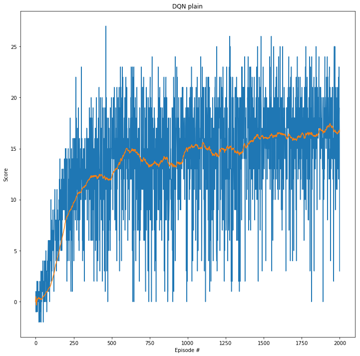
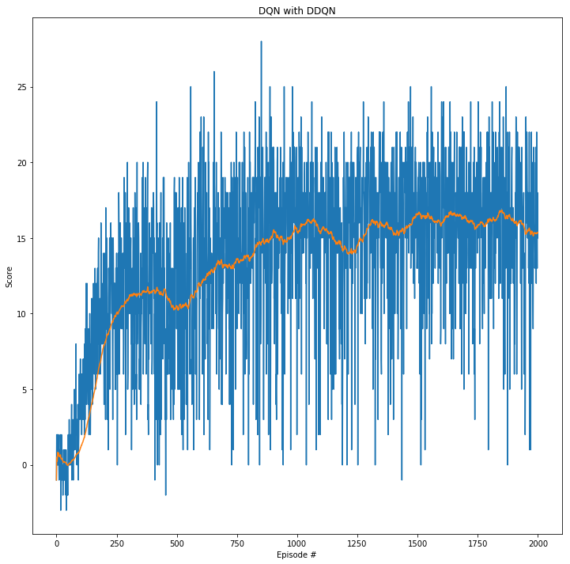
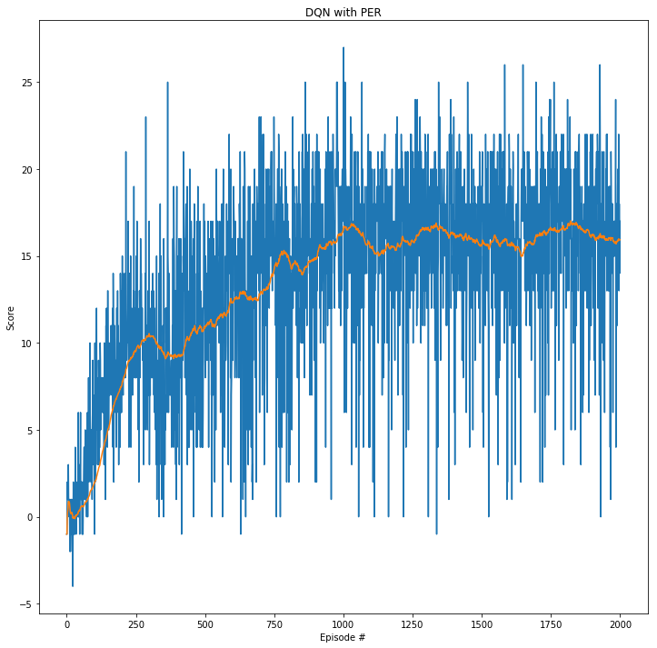
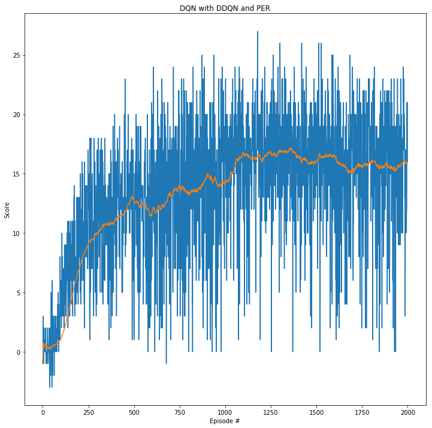
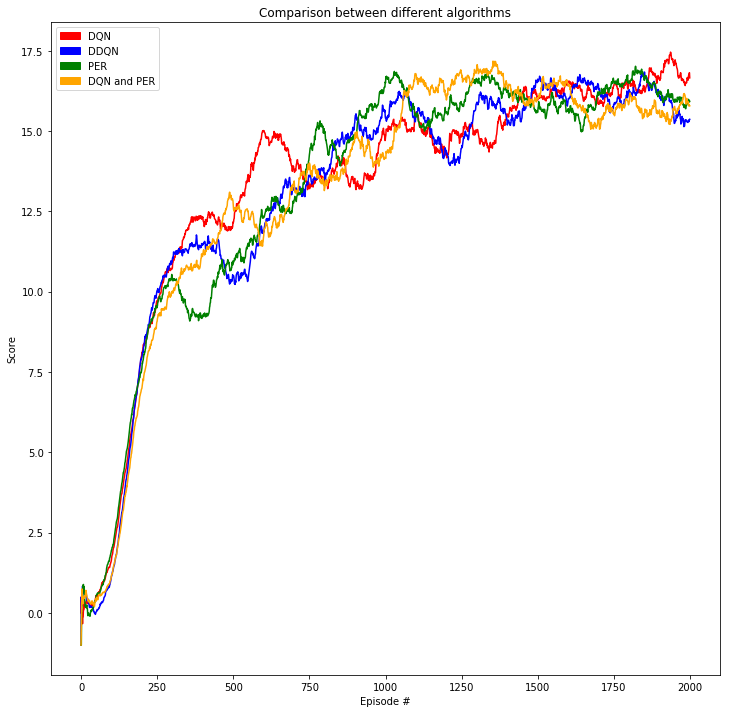

# Reports for the Deep Reinforcement Learning Nanodegree at Udacity

Here, you can find the reports regarding the three projects within the course. The projects are:
1. [Training an agent to collect yellow bananas while avoiding blue bananas.](#project-1-banana-collector-report)
2. [Training a robotic arm to reach target locations.](#project-2-reacher)
3. [Training a pair of agents to play tennis.](#project-3-tennis)

## Project 1: Banana Collector Report
### Implementation
The banana collector project consists of 
* main notebook [banana-collector](./project1-banana-collector/banana-collector.ipynb): it provides some information about the environment and runs the DQN algorithm against the headless Unity Environment of banana collector. It makes use of the python classes Agent ([agent.py](project1-banana-collector/modules/agent.py)), QNetwork ([qnetwork.py](project1-banana-collector/modules/qnetwork.py)) and ReplayBuffer ([replaybuffer.py](project1-banana-collector/modules/replaybuffer.py)).
* play notebook [banana-collector-play](./project1-banana-collector/banana-collector-play.ipynb): this notebook is reading a created q-network and is using the visual Unit Environment of banana collector. You will see, how the agent performs with the read q-network.
* class Agent ([agent.py](project1-banana-collector/modules/agent.py)): the **Agent** class is responsible for interacting with the environment, training the q-network models, storing the replay buffer and helps to save the q-network models.
* class qnetwork ([qnetwork.py](project1-banana-collector/modules/qnetwork.py)): the **QNetwork** class helps to create an instance of a q network.
* class ReplayBuffer ([replaybuffer.py](project1-banana-collector/modules/replaybuffer.py)): the **ReplayBuffer** class is responsible to keep track of the latest N experiences. It also can help to update existing experiences with information (if using **prioritized experience replay**).

### Learning Algorithm
The main notebook is running a comparison of following approaches:
* DQN
* DQN with Double DQN
* DQN with prioritized experience replay
* DQN with Double DQN and prioritized experience replay

To compare the four different approaches, we used following parameters for defining the agent, the neural network and the replay buffer.

Parameters for agent:
* UPDATE_EVERY = 13
* GAMMA = 0.99
* TAU = 1e-3
* PER_b = 0.001 (prioritized experience replay only)

Parameters/architecture for neural network:
* fc1_units = 256
* fc2_units = 256
* LEARNING_RATE = 5e-4
* BATCH_SIZE = 128  
* input layer with 37 nodes
* two hidden layer with RELU activation functions and 256 node each (fc1_units and fc2_units)
* output layer with four nodes (move forward, move backward, turn left, turn right)

Parameters for replay buffer:
* REPLAY_BUFFER_SIZE = int(1e5)

### Plot of Rewards
The four different approaches were able to solve the task (average score of +13 over 100 consecutive episodes) after N episodes:
* DQN => N = 426
* DQN with [Double DQN](https://arxiv.org/abs/1509.06461) => N = 557
* DQN with [prioritized experience replay](https://arxiv.org/abs/1511.05952) => N = 612
* DQN with Double DQN and prioritized experience replay => N = 388

Please take a look at the respective plots of rewards for each approach or improvement:

Comparison of all approaches in one image:

### Ideas for Future Work
Possible future ideas for improving the work are playing with different hyperparameter settings for each of the four approaches. Also, calculate an average of multiple runs with random seeds, one run may not be enough to make some good conclusions.

When using the prioritized experience replay approach, so far we have not introduced the parameter **alpha** for playing with some randomness in the experience selection, and a **variable parameter beta** for the important sampling weights (IS), it is constant at the moment.

Also, the prioritized experience replay is a naiv implementation that does not focus on being fast => introduce trees for storing and updating the experiences.

Implement [dueling DQN](https://arxiv.org/abs/1511.06581) as a further enhancement.

